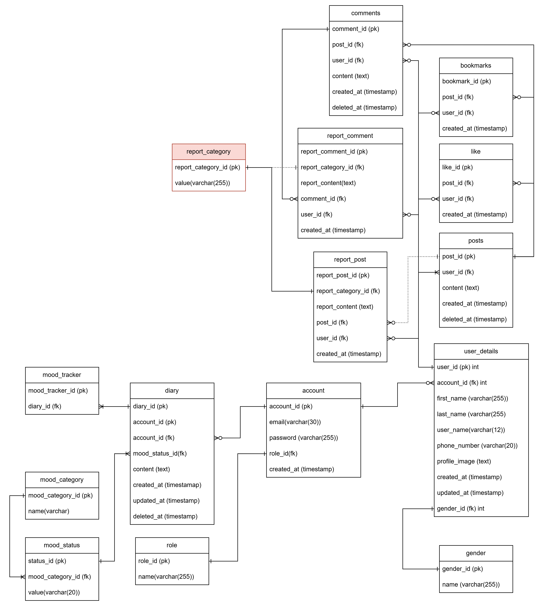

# zen-zone-server
# Zen-Zone Project

Zen Zone is a platform for mental health supports that provide users with counseling, offers a community forum for peer support and shared experiences, and includes a diary/journaling feature to help users track their mental health journey and emotions.

## Table of Contents

- [Overview](#overview)
- [ERD](#erd)
- [Prerequisites](#prerequisites)
- [Installation](#installation)
- [Environment Variables](#environment-variables)
- [Database Setup](#database-setup)
- [Running the Application](#running-the-application)
- [API Endpoints](#api-endpoints)
- [API Documentation](#api-documentation)
- [Deployment](#deployment)

## Overview

This project serves as the backend for Zen-Zone, handling all the data management and API functionalities. It integrates with Supabase for database services and uses CORS for cross-origin requests.

## ERD



## Prerequisites

- Python 3.10
- Poetry
- Flask
- Flask_jwt_extended
- Pydantic
- Supabase account and project setup

## Installation

1.  clone repository
    `git clone https://github.com/Adsyarif/Zen-Zone-Server-App.git`
    `cd Zen-Zone-Server-App`

2.  install package manager
    `pip3 install poetry` or you can follow the [Poetry installation guide](https://python-poetry.org/docs/)

3.  install depencies
    `poetry install`

4.  Activate the virtual environment
    `poetry shell`

## Environment Variables

Create a .env file in the root directory project and add the following variables:

```
FLASK_DEBUG=TRUE
FLASK_ENV=Development

DATABASE_TYPE=your_supabase_database_type
DATABASE_HOST=your_supabase_database_host
DATABASE_NAME=your_supabase_database_name
DATABASE_PORT=your_supabase_database_port
DATABASE_USER=your_supabase_database_user
DATABASE_PASSWORD=your_supabase_database_password

JWT_SECRET_KEY=your_secret_key
```

## Database Setup

1.  Initialize the database
    Since you're using Supabase, ensure your Supabase project is set up and the database schema is created.

2.  Run migrations
    If you have migrations set up in your project, run them to update the database schema.

## Running the Application

`poetry run flask run`

## API Endpoints

- GET /account: list all account
- POST /account/login: for login account
- GET /diary: list all diary
- GET /diary/<diary_id>: get a diary by ID
- GET /user_details: get user details
- GET /user_details/<account_id>: get user details by ID

## API Documentation

[Zen-Zone API Documentation](https://documenter.getpostman.com/view/32965341/2sA3s7iUBY)

## Deployment

### Build Docker Image

- install gunicorn `poetry add gunicorn`
- install docker `poetry add docker`
- create docker file dan .dockerignore
- check docker installed or not `sudo docker run hello-world`
- build docker image in existing directory `docker build -t namaimage . `
- if error occured like this **permission denied** try:
  1. `sudo systemctl restart docker`
  2. `sudo chmod 666 /var/run/docker.sock`
- run docker image `docker run -p 5000:5000 --env-file .env namaimagedocker`

### Railway Deploy

- login to railway, with your integrated github account
- choose repository to upload
- select variable, and input the data with your .env
- setting FLASK_DEBUG `true` to `false`
- setting FLASK_ENV `Development` to `Production`
- setting PORT with the following localhost app
